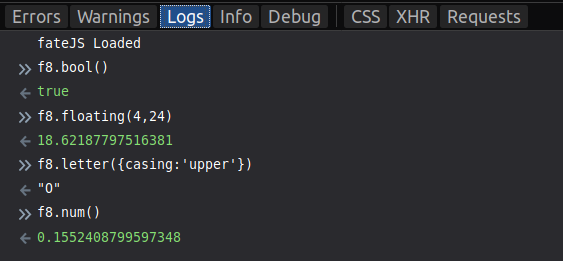

# fateJS
**fateJS** is a minimalist Javascript library for generating random strings, numbers, and truthy/falsy values. **fateJS** is modeled after [**Chance.js**](https://github.com/chancejs/chancejs), so head over there if you need any ideas of what to add here!

**fateJS** was created because I wanted to practice writing Javascript libraries. So **feel free** to fork and create pull requests! I want this project to grow.

Find the documentation <a href="https://pkellz.github.io/pk/fatedocs" target="_blank">here</a>

Written by [Patrick Scott](https://pkellz.github.io/pk).
